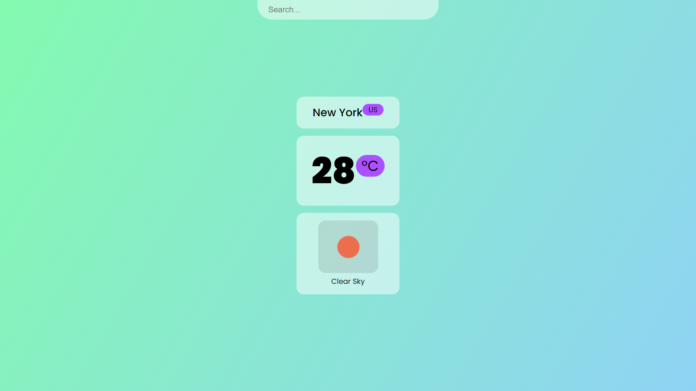

# Weather React App PWA

An clone application based on Project of [adrianhajdin](https://github.com/adrianhajdin 'JavaScript Mastery')

## Live Preview

[Weather React App PWA](https://weather-react-pwa-jsmastery.vercel.app/ 'Weather React App PWA')

### Tech/framework used

Build with:
-React
-sass
-axios

<b>Built with</b>

-   [React](https://reactjs.org/)
-   [SASS](https://sass-lang.com/)
-   [Axios](https://www.npmjs.com/package/axios)

### Installation and Setup Instructions

Clone down this repository. You will need `node` and `npm` installed globally on your machine.

Installation: `npm install`

To Start Server: `npm start`

To Visit App: `localhost:3000/`

#### By **[a12989x](https://github.com/a12989x, 'Alexis Guzman')**
